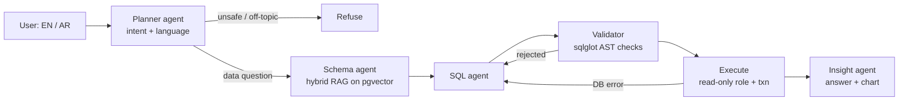

# Agentic Data Analyst

[](https://github.com/AHMED-DEEBB/agentic-data-analyst/actions/workflows/ci.yml)

Ask business questions in **Arabic or English** and get an answer, a chart, and the exact SQL behind it.
A LangGraph workflow of specialised agents plans the question, retrieves the relevant schema and business rules
(hybrid RAG), writes SQL, validates it, runs it read-only, self-corrects on errors, and explains the result.

## Why it matters

"Talk to your data" is one of the most requested enterprise AI use cases, and most demos stop at a prompt that
generates SQL. This project covers the parts production needs: guardrails, business-definition grounding,
bilingual support, self-correction, evaluation in CI, tracing, and a standard MCP interface.

## Architecture



| Agent | Job |
|---|---|
| Planner | Classifies intent (data / out of scope / unsafe), detects language, rewrites the question |
| Schema | Retrieves tables, business definitions and verified examples (semantic + keyword search, RRF fusion) |
| SQL writer | Drafts PostgreSQL; on failure receives the error and repairs (max 3 attempts) |
| Validator | Parses the SQL tree: one SELECT only, allowed tables only, no dangerous functions, row limit |
| Insight | Answers in the user's language with key numbers and picks a chart type |

## Security: defence in depth

Agent-generated SQL is never trusted. Four independent layers:

1. **AST validation** (sqlglot): rejects writes, DDL, multiple statements, system tables, `pg_sleep`/file functions.
2. **Read-only database role**: `analyst_ro` has `SELECT` on business tables only.
3. **Read-only transaction**, always rolled back.
4. **Statement timeout** and row cap.

The planner also refuses unsafe requests ("delete all orders", prompt-injection attempts) before any SQL is written.

## Evaluation

51 cases: 30 English and 15 Arabic analytics questions with gold SQL, plus 6 unsafe or off-topic prompts.
Scored by **execution accuracy** (the agent's result must match the gold query's result), refusal accuracy,
self-correction rate and latency. CI runs a subset on every push and fails the build below the threshold.

| Metric | Result |
|---|---|
| Execution accuracy, English | **100%** (30/30) |
| Execution accuracy, Arabic | **100%** (15/15) |
| Refusal accuracy (unsafe / off-topic) | **100%** (6/6) |
| Overall | **100%** (51/51), up from 90.2% on the first run |

The first run exposed three issues: the model sometimes returned SQL as markdown instead of the required
structured output, it occasionally invented date filters, and one correct answer used a pivoted layout.
Fixes: a format-error retry, stricter prompt rules, and a layout-tolerant scorer. Measured on Groq's free tier
(`openai/gpt-oss-120b`), run in two batches because of the daily token limit.

Full report: `evals/results/report.md` after a run.

## Quick start

Requirements: Docker, and a free Groq API key (https://console.groq.com/keys).

```bash
cp .env.example .env        # paste your GROQ_API_KEY
docker compose up --build   # first build downloads the embedding model
```

Open http://localhost:8000 (UI) or http://localhost:8000/docs (API).

```bash
make evals        # full evaluation suite
make test         # guardrail + scoring unit tests (no LLM needed)
```

Switch provider in `.env`: `LLM_PROVIDER=openai` or `LLM_PROVIDER=azure` (Azure OpenAI).

## Use it from Claude Desktop (MCP)

With the database running (`docker compose up`), install dependencies locally and add to your Claude Desktop config:

```json
{
  "mcpServers": {
    "data-analyst": {
      "command": "python",
      "args": ["-m", "app.mcp_server"],
      "cwd": "/absolute/path/to/agentic-data-analyst"
    }
  }
}
```

Tools exposed: `ask_analyst`, `list_tables`, `describe_table`, `run_sql` (validated, read-only).

## API

```bash
curl -X POST localhost:8000/ask -H "Content-Type: application/json" \
     -d '{"question": "ما هي الإيرادات حسب الفئة في 2024؟"}'
```

`POST /ask/stream` returns Server-Sent Events: one event per agent step, then the final result.

## Stack

LangGraph, LangChain, Groq / OpenAI / Azure OpenAI, PostgreSQL + pgvector, fastembed (multilingual embeddings),
sqlglot, FastAPI, MCP, Langfuse, Docker, GitHub Actions, pytest.
Each tool and every design decision is explained in [docs/TOOLS.md](docs/TOOLS.md).

## Data

Synthetic GCC retail dataset (8 stores in UAE, Saudi Arabia, Qatar, Kuwait; 600 customers; 6,000 orders;
2024-2025), generated with a fixed seed so results are reproducible. No real company data.

## Project structure

```
app/
  agents/      graph.py (LangGraph workflow), prompts, schemas, runner
  api/         FastAPI service
  knowledge/   schema docs, business glossary, verified examples (RAG source)
  static/      demo UI
  safety.py    SQL validator
  retrieval.py hybrid RAG on pgvector
  mcp_server.py
evals/         dataset + runner (execution accuracy)
tests/         guardrail and scoring tests
```

## Author

Ahmed Eldeep, AI Engineer (Dubai, UAE)
[LinkedIn](https://linkedin.com/in/ahmedeldeeb0) · [GitHub](https://github.com/AHMED-DEEBB)

## License

MIT